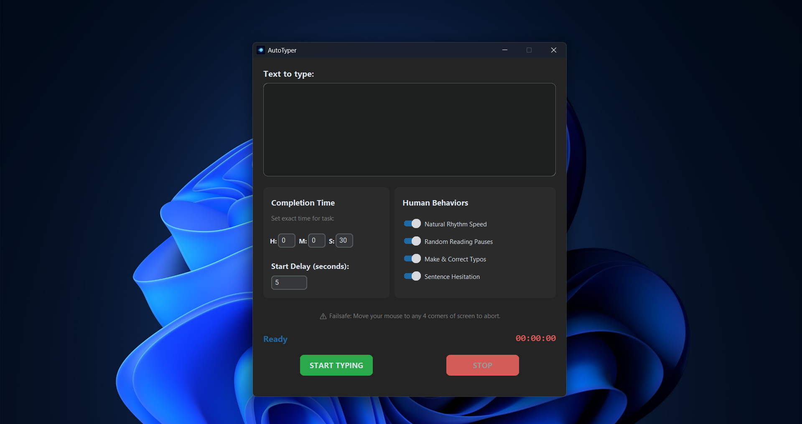

# AutoTyper

<p align="center">
  
</p>

<p align="center">
  Lightweight Python desktop app for controlled text typing automation on Windows and macOS
</p>

---

## 📸 Preview

<p align="center">
  
</p>

---

## Features

- ⏱️ **Time-based typing**
  - Complete text within a user-defined duration

- 🎛️ **Custom typing behavior**
  - Adjustable speed and rhythm
  - Sentence-aware pauses

- 🧠 **Natural pacing**
  - Smooth typing flow instead of instant paste

- 🖥️ **Cross-platform desktop UI**
  - Built with CustomTkinter
  - Clean dark-mode interface

- ⚡ **Responsive performance**
  - Background threading prevents freezing

- 🛑 **Safety system**
  - Start delay before typing begins
  - Mouse corner emergency stop (failsafe)

---

## Tech Stack

- Python  
- CustomTkinter  
- PyAutoGUI  
- Threading  

---

## Installation

```bash
git clone https://github.com/Thulnith-0/AutoTyper.git
cd AutoTyper
python -m venv .venv
. .venv/bin/activate
pip install -r requirements.txt
python autotyper.py
```

On Windows PowerShell, activate the virtual environment with:

```powershell
.venv\Scripts\Activate.ps1
```

Python 3.11 or newer is recommended.

---

## Usage

1. Enter your text  
2. Set completion time  
3. Click **Start**  
4. Switch to your target window before typing begins  

---

## macOS setup

macOS blocks keyboard automation until the app has Accessibility access.

1. Open `System Settings > Privacy & Security > Accessibility`
2. Allow Terminal when running from source, or allow the packaged `AutoTyper.app` when running a release build
3. Restart the app after granting permission

If you download an unsigned `.app` from GitHub Releases, Gatekeeper may warn the first time you open it. That is expected until the app is code-signed and notarized.

---

## Notes

- Make sure the correct window is selected before typing starts  
- Move your mouse to any screen corner to instantly stop typing  
- On macOS, grant Accessibility permission or typing automation will not work

---

## Release builds

This repo now includes a GitHub Actions workflow at `.github/workflows/release.yml` that builds:

- `AutoTyper-windows.zip`
- `AutoTyper-macos.zip`

To publish a new release:

1. Push your changes
2. Create and push a tag like `v1.1.0`
3. GitHub Actions will build both platforms and attach the zipped artifacts to the release

For a local build, install `pyinstaller` and run:

```bash
python scripts/build_release.py
```

If you want a custom macOS app icon in the packaged bundle, add `assets/icon.icns` before building.

---

## Project Structure

```
AutoTyper/
│
├── .github/
│   └── workflows/
│       └── release.yml
│
├── app/
│   ├── core/
│   ├── ui/
│   └── __init__.py
│
├── assets/
│   ├── icon.ico
│   └── screenshot.png
│
├── scripts/
│   └── build_release.py
│
├── autotyper.py
├── requirements.txt
├── README.md
└── .gitignore
```

---

## Future Improvements

- 🔹 Hotkey support (Start / Stop)
- 🔹 Save & load presets
- 🔹 Progress tracking UI
- 🔹 Typing profiles
- 🔹 UI enhancements

---

## License

MIT License

---

## Support

If you found this project useful, consider giving it a star ⭐
